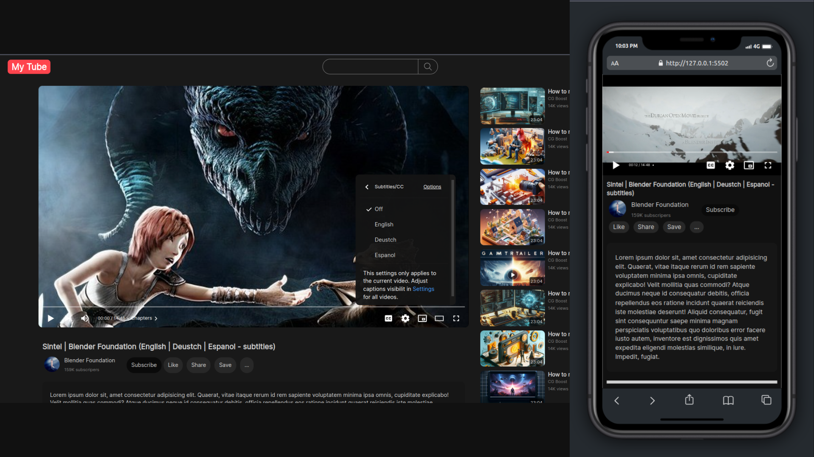

# YouTube Video Player Clone

## Preview

## Overview

This project is a clone of the YouTube video player page, developed using raw HTML, CSS, and JavaScript without any UI libraries. It showcases my skills in media control and UI handling through pure web technologies. The application replicates nearly all video-controlling features found in the YouTube video player, including:

- **View Modes:**
  - Fullscreen
  - Theater Mode
  - Picture-in-Picture

- **Subtitle Customization:**
  - Font Size
  - Color
  - Background Color

- **Video State Controls:**
  - Quality Settings
  - View Options
  - Subtitle Language Selection
  - Play/Pause Toggle
  - Mute/Unmute
  - Volume Control
  - Playback Speed Adjustment

- **Video Time Display:** 
  - Formatted using JavaScript.

## Technologies Used

- **Languages:** HTML5, CSS3, JavaScript (ES6)
  
- **APIs:**
  - **HTMLMediaElement API:** For controlling media elements (play, pause, mute/unmute, volume changes).
  - **Fullscreen API:** To enable fullscreen viewing for videos.
  - **Picture-in-Picture API:** To allow videos to play in a floating window.

## Best Practices

### HTML
- Utilized semantic HTML elements for improved accessibility.
- Implemented accessibility principles and attributes to enhance user experience.
- Integrated OpenGraph and Twitter meta tags for better social media presentation.

### CSS
- Applied consistent styling across the application.
- Organized stylesheets using modular CSS with `@import`.
- Ensured responsive design for mobile and desktop devices.
- Employed CSS Grid for responsive layout management of video containers, sidebars, and descriptions.
- Incorporated CSS animations and transitions for a dynamic user experience.
- Styled subtitles using the `::cue` pseudo-element.

### JavaScript
- Leveraged modern JavaScript (ES6) for functionality and DOM manipulation.
- Developed a custom progress slider using `div` elements and JavaScript events.
- Managed video actions such as play/pause, speed adjustments, volume control, and mute/unmute through the HTMLMediaElement API.
- Implemented various video views:
  - Normal Mode (default)
  - Picture-in-Picture Mode (`requestPictureInPicture()`)
  - Fullscreen Mode (`requestFullscreen()`)
  - Theater Mode (CSS layout adjustments)
  
- Created a dynamic settings menu that allows developers to add or remove options easily.
- Designed menu transition effects similar to YouTube's interface using CSS and JavaScript.
- Dynamically changed icons to enhance user experience.

## Accessibility

This project prioritizes accessibility by implementing several best practices:
- Utilized semantic elements throughout the application.
- Applied WAI-ARIA attributes where necessary (e.g., `role`, `aria-label`).
- Ensured that links and buttons are clearly defined and accessible.

## Usage

To run this project, open the `index.html` file on a local server. For convenience, you can use GitHub Pages or any live server extension.

## Contact

For inquiries or feedback, please reach out via email: [aiparsa83@gmail.com](mailto:aiparsa83@gmail.com).
